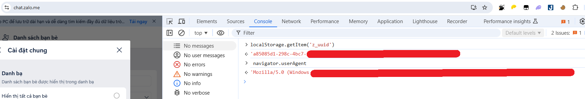
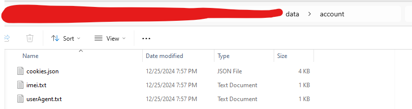
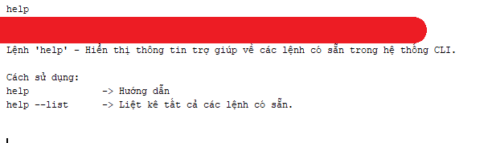

# ZaloClientLua

## Lưu ý

Hiện tại project này đã dừng update !!!!

## 📝 Giới thiệu

ZaloClientLua là một ứng dụng Java được phát triển để kết nối và tương tác với nền tảng chat.zalo.me thông qua giao thức WebSocket. Ứng dụng này sử dụng Lua nhúng để xử lý các callback và tương tác với API của Zalo, trong khi các logic kết nối tới server được giữ kín và không tiết lộ cho người dùng. Lua sẽ gọi các API từ Java để thực hiện các tác vụ cần thiết trong quá trình chương trình chạy.

**Cam kết bảo mật**: ZaloClientLua cam kết không lưu trữ hoặc sao lưu bất kỳ thông tin nào liên quan đến tài khoản Zalo của người sử dụng, bao gồm dữ liệu đăng nhập, tin nhắn hoặc bất kỳ thông tin cá nhân nào khác. Mọi giao tiếp giữa ứng dụng và server đều được mã hóa, đảm bảo tính bảo mật tuyệt đối và tuân thủ các tiêu chuẩn bảo mật cao nhất.

**Cam kết về tính minh bạch và bảo mật**: Chúng tôi cam kết không sử dụng bất kỳ kỹ thuật backdoor nào hoặc thực hiện bất kỳ hành vi đánh cắp thông tin người dùng nào. ZaloClientLua không thu thập hoặc gửi bất kỳ dữ liệu nào mà không có sự đồng ý của người sử dụng. Ứng dụng hoàn toàn minh bạch trong cách thức hoạt động và đảm bảo quyền riêng tư của người dùng luôn được bảo vệ.

## 🔧 Công nghệ sử dụng

- **Java WebSocket**: Thư viện java-websocket được sử dụng để thiết lập và duy trì kết nối WebSocket
- **Lua**: Lua được nhúng vào ứng dụng Java để xử lý các callback khi có tin nhắn tới và gọi các API từ Java để xử lý logic.
- **DLL tùy chỉnh**: Các thư viện DLL được phát triển riêng để xử lý quá trình mã hóa và giải mã dữ liệu trong quá trình trao đổi thông tin với server

## ⚙️ Tính năng chính

- Kết nối WebSocket an toàn với chat.zalo.me.
- Mô phỏng hành vi trình duyệt web.
- Tự động hóa tương tác với API Zalo thông qua Lua.
- Các callback trả về từ server sẽ được Lua xử lý và gọi các API Java tương ứng.
- Mã hóa và giải mã dữ liệu trao đổi.
- Xử lý phản hồi từ server một cách hiệu quả.

## 📦 Cài đặt và sử dụng

### Cài đặt

#### 1. Giải nén Release.rar

#### 2. Cấu hình file config.yml

#### 3. Lấy data account Zalo

- tạo cookie

  cài extension: https://chromewebstore.google.com/detail/J2TEAM%20Cookies/okpidcojinmlaakglciglbpcpajaibco

  export file cookie.json vào thư mục data

- lấy imei, cookie

  bật f12, vào phần console, paste lần lượt câu lệnh sau

  ```
  localStorage.getItem('z_uuid')
  navigator.userAgent
  ```

  

  **Sau đó lưu vào thư mục đã config account data: 3 file như sau:**

  

### Sử dụng

1. **Tùy chỉnh mã nguồn Lua và cấu hình**  
   Bạn có thể tùy ý chỉnh sửa mã nguồn Lua và file cấu hình `config.yml` để phù hợp với nhu cầu sử dụng của mình. Cấu hình này cho phép bạn thay đổi các thông số kết nối và các hành vi của ứng dụng.

2. **Chạy ứng dụng**  
   Để bắt đầu sử dụng ứng dụng, chỉ cần chạy file `Release.exe`. Khi chương trình đã chạy, bạn có thể nhập `help` vào giao diện chương trình để nhận được các câu lệnh hướng dẫn sử dụng chi tiết.

3. **Các câu lệnh cơ bản trong chương trình**
   - Nhập `help` để hiển thị danh sách các lệnh hỗ trợ.
   - Các lệnh khác sẽ giúp bạn tương tác với server Zalo, thay đổi cấu hình và kiểm tra trạng thái kết nối.

### CLI



## 📞 Liên hệ

Nếu bạn có bất kỳ câu hỏi hoặc góp ý nào, vui lòng liên hệ qua các kênh sau:

- 📧 **Email**: vichuyen.123@gmail.com
- 👥 **Facebook**: [SQ Khánh](https://www.facebook.com/khanhdepzai.pro/)

## ⚠️ Tuyên bố miễn trừ trách nhiệm

Đây là dự án độc lập và không được xác nhận chính thức bởi Zalo. Người phát triển hoàn toàn không chịu trách nhiệm cho bất kỳ hành vi sử dụng nào vi phạm điều khoản dịch vụ của Zalo. Việc sử dụng phần mềm này đồng nghĩa với việc người dùng chấp nhận tự chịu trách nhiệm cho mọi hậu quả phát sinh từ việc sử dụng không đúng mục đích hoặc vi phạm điều khoản dịch vụ của Zalo.

Người dùng cần:

- Tìm hiểu kỹ và tuân thủ điều khoản sử dụng của Zalo
- Sử dụng phần mềm một cách có trách nhiệm và hợp pháp
- Tự chịu trách nhiệm về mọi hành vi của mình khi sử dụng phần mềm này
